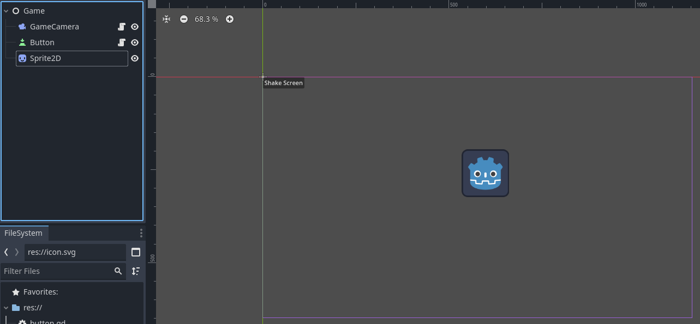

Screen shake is one of those subtle yet powerful game design elements that enhance player experience. It adds a visceral weight to actions, making abilities feel more powerful, impacts more satisfying, and dramatic moments more intense. This simple visual technique often gets overlooked while being extremely simple and easy to add.

Here's how we can implement this effect in Godot.

In a Global script define a signal with the parameters ```intensity```,```duration``` and a function that will emit it.

```
#SignalBus.gd

extends Node

signal screen_shake(intensity: float, duration: float)

func emit_screen_shake(intensity: float, duration: float):
	emit_signal("screen_shake", intensity, duration)

```

Then add a Camera2D node to your scene and attach a script to it.

```
extends Camera2D

var shake_intensity: float = 0.0 # How strong the shaking is
var shake_decay: float = 0.0 # How quickly the shaking fades

func _ready() -> void:
	SignalBus.screen_shake.connect(_on_screen_shake_emitted)

func _process(delta: float) -> void:
	if shake_intensity > 0:
		offset = Vector2(
			randf_range(-shake_intensity, shake_intensity),
			randf_range(-shake_intensity, shake_intensity)
			)
		shake_intensity = lerp(shake_intensity, 0.0, shake_decay * delta)
	else:
		offset = Vector2.ZERO
		
func apply_screen_shake(intensity: float, duration: float):
	shake_intensity = intensity
	shake_decay = duration
	await get_tree().create_timer(shake_decay).timeout
	shake_intensity = 0.0

func _on_screen_shake_emitted(intensity, duration):
	apply_screen_shake(intensity, duration)
```

Alright this may seem scary at first but let's understand what is going on here. In ```_ready``` we connect to the signal we just created and then define a function for what will happen when it gets emitted ```_on_screen_shake_emitted```. 

Inside that function we finally invoke the ```apply_screen_shake``` which in turn passes the transmitted intensity and duration into the local variables ```shake_intensity```,```shake_decay``` and creates a timer that resets the intensity to 0 when it runs out.

In ```_process``` we handle the actual shaking effect by checking the ```shake_intensity``` parameter every frame when it's higher than 0 it means we requested a screen shake so then it moves on to randomly offsetting the camera creating that shake effect while it gradually reduces the intensity over time using ```lerp``` 

And there you have it, now you can test it out like this.



Add a button to your scene, connect the pressed signal, and use the SignalBus to emit the signal with the intensity and duration you want.

```
#button.gd

extends Button

func _ready() -> void:
	pressed.connect(_on_pressed)
	
func _on_pressed():
	SignalBus.emit_screen_shake(5, 5)
```

Enjoy!