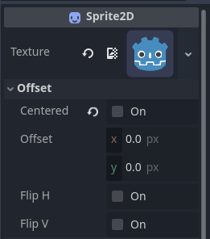

Many of you know the typical way to set collision shapes is to add a CollisionShape2D node to a scene and then through the editor you configure a shape that more or less fits your sprite, what if I told you there is a way to assign pixel perfect collisions to your sprites without doing it manually.

This cool little function comes originally through a friend on discord (MissArticulatePython) and I have only slightly adjusted it.

```
static func build_collider_poly_from_sprite(sprite: Image):
	var bitmap = BitMap.new()
	bitmap.create_from_image_alpha(sprite)

	# The "2" parameter controls how precise the shape is (smaller is more accurate)
	var polys = bitmap.opaque_to_polygons(sprite.get_used_rect(), 2)

	var shapes = []
	for poly in polys:
		var collider = CollisionShape2D.new()
		var collider_shape = ConvexPolygonShape2D.new()
		collider_shape.points = poly
		collider.shape = collider_shape
		shapes.append(collider)

	return shapes
```

Simply explained this function takes an image, then detects all the non-transparent pixels and creates one or more polygon shapes that wrap around those visible pixels and then returns an array of collision shapes, let's look into how you can now give this collision shape to an object.

```
func _ready() -> void:
	var collision_shapes = Utilities.build_collider_poly_from_sprite(sprite.texture.get_image())

	for shape in collision_shapes:
		add_child(shape)
		
		shape.position = sprite.position
		shape.scale = sprite.scale
```

Since it is a static function you can have it inside a Utilities class script and simply invoke it like this in any node in the project, ```shape.position = sprite.position``` and ```shape.scale = sprite.scale``` make sure your collision shape is perfectly centered and also follows your sprites scaling. 

One last thing is that to have the collision properly assigned on top of the sprite you must disable the Centered property in your sprite.




Why it's useful:

Apart from not having to do it manually, you can create really cool enemy and objects systems for example using Resources, which will also keep your code quite clean without the need to make different scenes for each one that needs its own different collision shape.


