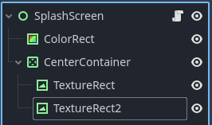

A splash screen is a brief visual displayed when a game or application first loads, while it is not a vital component of a game, it is something that adds an air of professionalism and builds some anticipation. Being so easy to implement it should be a part of any template and game no matter how small.

Here is how we can make a splash screen.



Add a control node name it something like SplashScreen then you want a ColorRect node that will serve as a solid color background when the images fade in and out of the screen.

Then in a CenterContainer node you can add as many TextureRect nodes as you want, assign the images in the order you want them playing on the screen.

Finally attach a script to your scene root, save the scene and let's get started

```
#splash_screen.gd

extends Control

@export var load_scene: PackedScene #the scene that will load when the splash screens end
@export var in_time: float = 0.5
@export var fade_in_time: float = 0.5
@export var pause_time: float = 1.0
@export var fade_out_time: float = 0.5
@export var out_time: float = 0.4

#assign the center container here so we can loop through its children
@export var splash_screen_container: CenterContainer 

var splash_screens: Array
var current_screen_index: int = -1
var current_tween: Tween

func _ready() -> void:
	get_screens()
	show_next_screen()
	
func get_screens():
	splash_screens = splash_screen_container.get_children()
	for screen in splash_screens:
		screen.modulate.a = 0.0
		
func show_next_screen():
	if current_tween != null and current_tween.is_running():
		current_tween.kill()
		
	if current_screen_index >= 0 and current_screen_index < splash_screens.size():
		var current_screen = splash_screens[current_screen_index]
		current_screen.modulate.a = 0.0
		
	current_screen_index += 1
	
	if current_screen_index < splash_screens.size():
		var screen = splash_screens[current_screen_index]
		current_tween = create_tween()
		current_tween.tween_interval(in_time)
		current_tween.tween_property(screen, "modulate:a", 1.0, fade_in_time)
		current_tween.tween_interval(pause_time)
		current_tween.tween_property(screen, "modulate:a", 0.0, fade_out_time)
		current_tween.tween_interval(out_time)
		current_tween.finished.connect(show_next_screen)
	else:
		load_next_scene()
		
func load_next_scene():
	if load_scene != null:
		get_tree().change_scene_to_packed(load_scene)

func _unhandled_input(event: InputEvent) -> void:
	if event.is_pressed():
		show_next_screen()

```

This is pretty straightforward but let's go through each function, ```get_screens``` simply populates the ```splash_screens``` array with all the images then for each screen in the array we set it's Alpha channel to 0 which means it will be transparent.

Now ```show_next_screen``` is where all the magic happens, first we check if there is an active tween and then have it stop playing, then we make the ```current_screen``` invisible if we are skipping to the next one, we only call this function when we want to move to the next screen this is basically how the user will skip through the images if they want to.

After incrementing the ```current_screen_index``` which tracks which scene is playing, we move on to our little tweens which just modify the image Alpha channel gradually creating a nice transition effect when the image enters and leave the screen, and when there is no images left we call ```load_next_scene```.

```load_next_scene``` just changes the scene to whatever you want to load when the splash screens end, typically you would load into a main menu for example.

```_unhandle_input``` checks if there is any keys pressed which would indicate the user is trying to skip the screens and simply calls ```show_next_screen``` which handles the skipping logic.

That's it, feel free to play around with the export variables, add your images and enjoy~.


